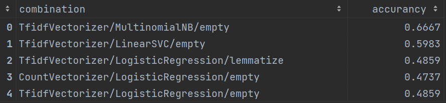
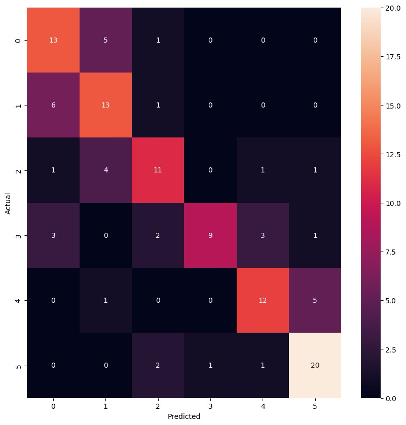
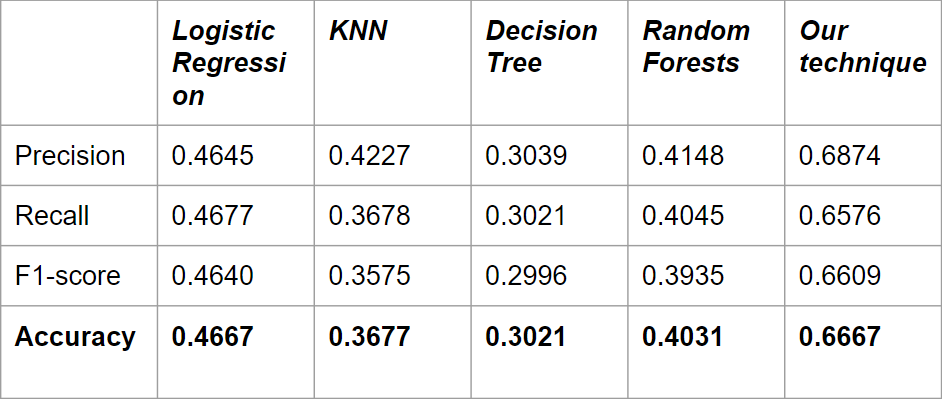

# Unil Kaggle competition
## Team Tesla

**Members**: 
- Kabasa Jonathan 
- Osorio Santos Joël

<h1>Detecting the Difficulty Level of French Texts</h1>

The project consists in predicting the difficulty level of a text in French (A1, A2, B1, B2, C1, C2). For this purpose, we have a training dataset including the columns "sentences" and "difficulty", as well as a dataset including only the column "sentences" for which we have to predict the difficulty using different approaches.

<h2>Data sets</h2>
<ul>
  <li>Training data set: includes "sentences" and "difficulty" columns</li>
  <li>Unlabelled data set: includes only the "sentences" column for which we have to predict the difficulty</li>
</ul>
<h2>Approaches tested</h2>
<ol>
  <li>Data Cleaning
    <ol>
      <li>Removal of empty words</li>
      <li>Data cleaning</li>
    </ol>
  </li>
  <li>Vectorization
    <ol>
      <li>Hash</li>
      <li>TF-IDF</li>
      <li>CountVectorizer</li>
    </ol>
  </li>
  <li>Classifiers
    <ol>
      <li>Linear Regression</li>
      <li>Logistic regression</li>
      <li>LinearSVC</li>
      <li>MultinomialNB</li>
      <li>VotingClassifier</li>
    </ol>
  </li>

  

For more information about the approach and exemple of usage,<a href="documents/getstarted.md"> click here </a>

For more information about the glossary <a href="documents/lexique.md"> click here </a>

</ol>
<h2>Results</h2>
<h3>Our results by accuracy</h3>

We can see in the image below, after finding the best parameters and the best combination of cleaner/vectorizer/classifier, that
 the combination TfidfVectorizer/MultinomialNB/empty gives the best accuracy : 0.6667

 

We can see in the image below, the confusion matrix of our best result

 

We can see in the image below, that our technique gave the best result. The combination that gave us this result was also done without data cleaning, so we can
say that the MultinomialNB is a good technique in comparison with the other ones.

 

<h2>Link to the Video</h2>

Here above, you can find the link to a YouTube video to have a visual presentation of our technique

<a href="https://www.youtube.com/watch?v=b0d5uGUHQZg">click here</a>
